EDA
================
Johannes Harmse
April 9, 2018

``` r
library(tidyverse)
```

``` r
# removing confidential data
survey_results <- read_csv(file = '../../survey_data/Demographic Survey.csv', skip = 1)
```

    ## Warning: Missing column names filled in: 'X1' [1], 'X2' [2], 'X3' [3],
    ## 'X4' [4], 'X5' [5], 'X6' [6], 'X7' [7], 'X8' [8], 'X9' [9]

    ## Warning: Duplicated column names deduplicated: 'Response' =>
    ## 'Response_1' [11], 'Response' => 'Response_2' [14]

    ## Parsed with column specification:
    ## cols(
    ##   .default = col_character(),
    ##   X1 = col_double(),
    ##   X2 = col_integer(),
    ##   `Annual Salary (before deductions)` = col_integer(),
    ##   `Annual salary (before deductions)` = col_integer(),
    ##   `Living Expenses (utilities, rent, mortgage, transportation, property taxes if owner, etc.)` = col_integer(),
    ##   `Savings (retirement, investments, emergency funds, etc.)` = col_integer(),
    ##   `Vacation (lodging, transportation, day trips, etc.)` = col_integer(),
    ##   `Daily Leisure (eating out, books, movies, self-care, etc.)` = col_integer(),
    ##   `Consumption Goods (clothing, electronics, other luxury items, etc.)` = col_integer(),
    ##   `Personal Sports and Hobbies (sporting goods and services, gym, arts and crafts, etc.)` = col_integer(),
    ##   `Other (health care, taxes, dependent expenses, etc.)` = col_integer()
    ## )

    ## See spec(...) for full column specifications.

``` r
survey_results <- survey_results[, 10:ncol(survey_results)]


#import data
# survey_results <- read_csv(file = '../../survey_data/Demographic Survey.csv') # local path - remove identifiers beforehand

# redefine column names
colnames(survey_results) <- c('consent', 'country', 'salary_base', 'salary_expect', 'no_increase_acceptance', 
                           'living_expenses', 'savings', 'vacation', 'daily_leisure', 'consumption_goods', 
                           'sports_hobbies', 'other')

# spending categories
spending_cats <- c('living_expenses', 'savings', 'vacation', 'daily_leisure', 'consumption_goods', 
                           'sports_hobbies', 'other')

# remove no consent
survey_results <- survey_results %>% filter(consent %in% c('Yes'))

# add observation id
survey_results$id <- 1:nrow(survey_results)

# save raw clean data
saveRDS(survey_results, file = '../data/processed/surveydata_clean.rds')

# remove all traces
rm(survey_results)
```

``` r
# import clean data
survey_results <-  readRDS(file = '../data/processed/surveydata_clean.rds')
survey_results %>% head()
```

    ## # A tibble: 6 x 13
    ##   consent country             salary_base salary_expect no_increase_accep~
    ##   <chr>   <chr>                     <int>         <int> <chr>             
    ## 1 Yes     United States of A~      100000        145000 Yes               
    ## 2 Yes     Canada                   140000        150000 No                
    ## 3 Yes     Canada                    60000         65000 Yes               
    ## 4 Yes     South Africa             250000        400000 No                
    ## 5 Yes     South Africa             550000        550000 Yes               
    ## 6 Yes     Canada                    50000         90000 No                
    ## # ... with 8 more variables: living_expenses <int>, savings <int>,
    ## #   vacation <int>, daily_leisure <int>, consumption_goods <int>,
    ## #   sports_hobbies <int>, other <int>, id <int>

We want to measure whether a person is driven by money or not. We found it reasonable to assume that a person who is driven by money would expect to earn more than the average person who has the same skillset and experience.

Our survey has captured the salary of what a participant thinks an average person with their skills and experience should earn, as well as the salary that the participant expects to receive in 1 year's time. Taking inflation and other micro-factors into account, a participant's expected salary in a year's time shouldn't be much higher than the average person with the same skills and experience.

The survey captured the participant's salary in their unique currency. The survey was answered by people from various countries with different currencies. This means that we cannot compare the captured salary values between participants. An easy way of standardising these values is to handle the salary values as a ratio of expected salary over average salary. The ratio should be consistent across different currencies.

``` r
# get ratio
survey_results <- survey_results %>% 
  mutate(ratio = salary_expect/salary_base)
```

Before we continue, we should consider any outliers that may be due to typos during survey completion.

``` r
##### OUTLIER PLOT!!!!!!!
```

``` r
##### REMOVE OUTLIERS USING BOXPLOT!!!!!!!!

#### REMOVE CODE CHUNK BELOW
```

``` r
# remove outliers
survey_results <- survey_results %>% 
  filter(!ratio %in% boxplot.stats(survey_results$ratio)$out)

# replace NA spendings with 0

survey_results[ , spending_cats][is.na(survey_results[ , spending_cats])] <- 0
```

``` r
ggplot(data = survey_results, aes(x = country, y = ratio, colour = country, fill = country)) + 
  geom_jitter() + 
  geom_violin(alpha = 0.2)
```

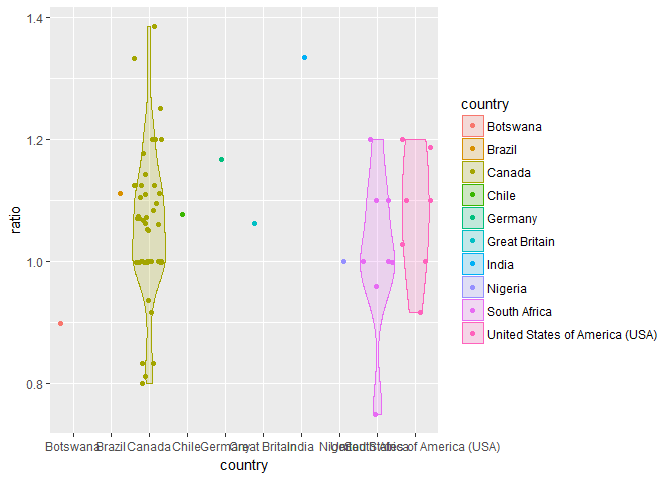

Our assumption seems to be accurate. There is no country that has a significantly higher or lower ratio distribution.

``` r
ggplot(data = survey_results, aes(x = ratio)) + 
  geom_density(colour = 'red', fill = 'red', alpha = 0.2)
```

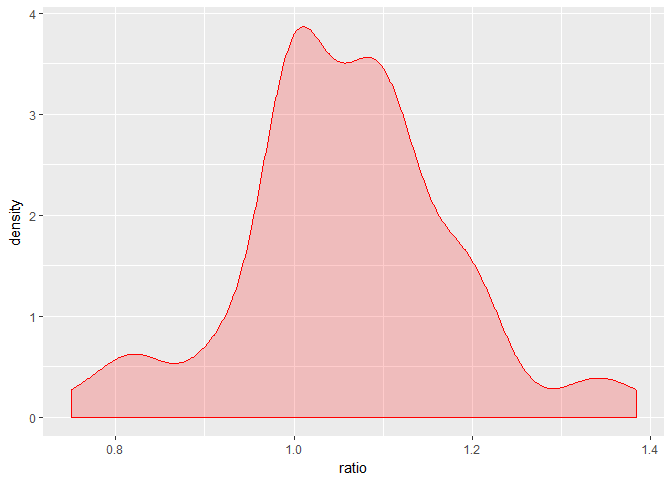 The study is interested in the ratio distribution above. Is there any correlation between the above ratio and social standards?

The survey captured the percentages of the main expenses of each participant. Each participant had to assign percentages that adds up to 100%. The different expense categories were strategically chosen which are believed to relate to a person's social standards. For example, it is believed that a person who spends a large percentage on vacations and daily leisure most likely has higher social standards than a person who contributes most of their salary to savings. The hypothesis is that a person with higher social standards will have a higher salary ratio as described above.

In theory this makes sense to simply compare these expense percentages to the salary ratios and look for any significant correlation. But in the real world there are many confounders that have to be accounted for. For example, a person who is close to retirement will most likely not expect an increase in the coming year, but may spend a large portion of their salary on vacations and daily leisure.

It isn't always as clear-cut as to say that the closer you are to retirement, the more you will spend on vacation. Or on the other side of the spectrum, it cannot be assumed that a young person won't spend a large percentage of their income on traveling.

The first confounder that we believe is of importance, is whether a person prefers job satisfaction over an increase in salary. The survey raised the question whether a person would keep their job if they don't receive a salary increase in two years, given high job satisfaction.

A person who spends a lot on vacation and leisure (which can be either the younger or older generation) may strive for a higher salary, but the possibility exists that they don't - possibly depending whether they value job satisfaction over a salary increase.

``` r
survey_results %>% group_by(no_increase_acceptance) %>% summarise(participants = n())
```

    ## # A tibble: 2 x 2
    ##   no_increase_acceptance participants
    ##   <chr>                         <int>
    ## 1 No                               20
    ## 2 Yes                              51

``` r
ggplot(survey_results, aes(x = ratio, group = no_increase_acceptance, colour = no_increase_acceptance)) + 
  geom_density(aes(fill = no_increase_acceptance), alpha = 0.2)
```

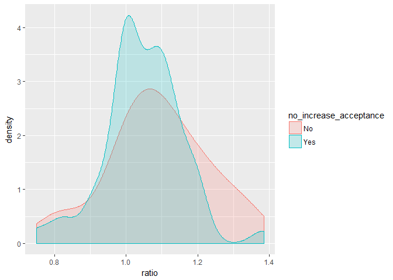

The plot above shows similar salary ratio distributions for participants who prefer high job satisfaction as those who prefer a salary increase. It does seem as if a person who has a higher salary ratio has a higher probability of prefering an increase over job satisfaction, even though this probability isn't significant. However, it will be of more importance if the distributions looked different for people with different types of expenses.

It is difficult to visualize the interaction between expenses, salary ratio and job satisfaction versus salary increase preference. It seems more logical and of statistical importance to fit comparitive models and observe whether the confounder variable adds any value to the model.

The salary ratio is a continuous variable and from our ratio probability distribution earlier, we saw that the standard deviation is fairly normally distributed around the mean after removing outliers. For this reason a linear regression model seems like a sensible model to fit to our data.

We want to determine whether the preference for job satisfaction interacts with with our explanatory variables. The explanatory variables in our case are the expense categories. We need to compare an additive linear model with a model that considers job satisfaction as a variable that interacts with our expense categories.

``` r
# model without interaction
lm_survey <- lm(ratio ~ living_expenses + 
                  savings + 
                  vacation + 
                  daily_leisure + 
                  consumption_goods + 
                  sports_hobbies + 
                  other, data = survey_results)

summary(lm_survey)
```

    ## 
    ## Call:
    ## lm(formula = ratio ~ living_expenses + savings + vacation + daily_leisure + 
    ##     consumption_goods + sports_hobbies + other, data = survey_results)
    ## 
    ## Residuals:
    ##      Min       1Q   Median       3Q      Max 
    ## -0.32290 -0.05802 -0.00767  0.06133  0.30502 
    ## 
    ## Coefficients: (1 not defined because of singularities)
    ##                     Estimate Std. Error t value Pr(>|t|)    
    ## (Intercept)        1.0961144  0.1122856   9.762  2.7e-14 ***
    ## living_expenses   -0.0007987  0.0012893  -0.619    0.538    
    ## savings           -0.0008328  0.0016622  -0.501    0.618    
    ## vacation          -0.0017813  0.0024973  -0.713    0.478    
    ## daily_leisure     -0.0003918  0.0020366  -0.192    0.848    
    ## consumption_goods  0.0021812  0.0031719   0.688    0.494    
    ## sports_hobbies     0.0015482  0.0033636   0.460    0.647    
    ## other                     NA         NA      NA       NA    
    ## ---
    ## Signif. codes:  0 '***' 0.001 '**' 0.01 '*' 0.05 '.' 0.1 ' ' 1
    ## 
    ## Residual standard error: 0.1209 on 64 degrees of freedom
    ## Multiple R-squared:  0.05402,    Adjusted R-squared:  -0.03467 
    ## F-statistic: 0.6091 on 6 and 64 DF,  p-value: 0.7221

Without any interaction, none of the expenses carry any statistical significance. Below we allow the job satisfaction versus salary increase preference to interact with the expense explanatory variables.

``` r
# model with interaction
lm_survey <- lm(ratio ~ no_increase_acceptance:(living_expenses + 
                  savings + 
                  vacation + 
                  daily_leisure + 
                  consumption_goods + 
                  sports_hobbies + 
                  other), data = survey_results)

summary(lm_survey)
```

    ## 
    ## Call:
    ## lm(formula = ratio ~ no_increase_acceptance:(living_expenses + 
    ##     savings + vacation + daily_leisure + consumption_goods + 
    ##     sports_hobbies + other), data = survey_results)
    ## 
    ## Residuals:
    ##      Min       1Q   Median       3Q      Max 
    ## -0.31909 -0.06406 -0.00684  0.05699  0.28757 
    ## 
    ## Coefficients: (1 not defined because of singularities)
    ##                                               Estimate Std. Error t value
    ## (Intercept)                                  1.166e+00  1.116e-01  10.450
    ## no_increase_acceptanceNo:living_expenses    -8.975e-04  1.448e-03  -0.620
    ## no_increase_acceptanceYes:living_expenses   -1.526e-03  1.312e-03  -1.163
    ## no_increase_acceptanceNo:savings            -4.790e-03  4.066e-03  -1.178
    ## no_increase_acceptanceYes:savings           -4.291e-04  1.662e-03  -0.258
    ## no_increase_acceptanceNo:vacation           -1.371e-03  5.880e-03  -0.233
    ## no_increase_acceptanceYes:vacation          -5.661e-03  2.805e-03  -2.018
    ## no_increase_acceptanceNo:daily_leisure      -6.113e-03  2.830e-03  -2.160
    ## no_increase_acceptanceYes:daily_leisure      1.533e-03  2.629e-03   0.583
    ## no_increase_acceptanceNo:consumption_goods   7.915e-03  4.884e-03   1.621
    ## no_increase_acceptanceYes:consumption_goods -2.720e-03  4.083e-03  -0.666
    ## no_increase_acceptanceNo:sports_hobbies      1.477e-02  1.053e-02   1.402
    ## no_increase_acceptanceYes:sports_hobbies    -4.979e-05  3.474e-03  -0.014
    ## no_increase_acceptanceNo:other              -8.263e-03  4.640e-03  -1.781
    ## no_increase_acceptanceYes:other                     NA         NA      NA
    ##                                             Pr(>|t|)    
    ## (Intercept)                                 7.32e-15 ***
    ## no_increase_acceptanceNo:living_expenses      0.5378    
    ## no_increase_acceptanceYes:living_expenses     0.2496    
    ## no_increase_acceptanceNo:savings              0.2436    
    ## no_increase_acceptanceYes:savings             0.7972    
    ## no_increase_acceptanceNo:vacation             0.8164    
    ## no_increase_acceptanceYes:vacation            0.0483 *  
    ## no_increase_acceptanceNo:daily_leisure        0.0350 *  
    ## no_increase_acceptanceYes:daily_leisure       0.5622    
    ## no_increase_acceptanceNo:consumption_goods    0.1106    
    ## no_increase_acceptanceYes:consumption_goods   0.5080    
    ## no_increase_acceptanceNo:sports_hobbies       0.1663    
    ## no_increase_acceptanceYes:sports_hobbies      0.9886    
    ## no_increase_acceptanceNo:other                0.0803 .  
    ## no_increase_acceptanceYes:other                   NA    
    ## ---
    ## Signif. codes:  0 '***' 0.001 '**' 0.01 '*' 0.05 '.' 0.1 ' ' 1
    ## 
    ## Residual standard error: 0.1154 on 57 degrees of freedom
    ## Multiple R-squared:  0.2328, Adjusted R-squared:  0.05782 
    ## F-statistic:  1.33 on 13 and 57 DF,  p-value: 0.2231

Above we see that that the job satisfaction confounder variable does contribute towards the correlation between daily leisure, vacation and salary ratio.

Below we visualize daily leisure while accounting for our confounder variable.

``` r
ggplot(survey_results, aes(y = ratio, x = daily_leisure, group = no_increase_acceptance, colour = no_increase_acceptance)) + 
  geom_point(aes(fill = no_increase_acceptance), alpha = 0.2) + 
  geom_smooth(method = "lm")
```

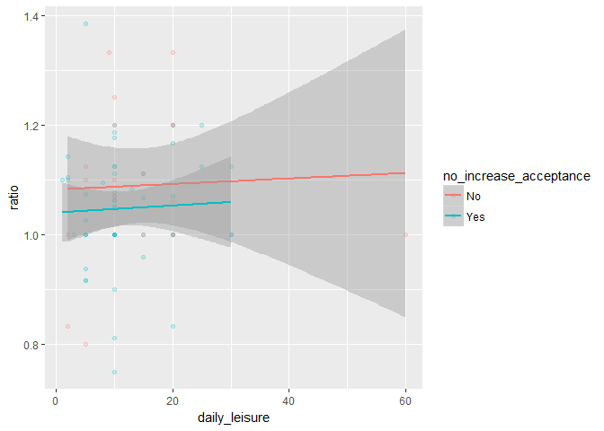

Even though the model found some significance, our visualization seems to disagree to an extent. It might be the daily leisure outlier value that is contributing towards the difference in slopes. The difference in slopes is also quite marginal.

We aren't directly interested in a person's preference between job satisfaction and salary increase, but we do need to take into account how this variable is influencing our study. There are various ways of dealing with confounding variables, but given our our dataset size, our options are limited. For now, including this interaction in our model should be sufficient to maintain awareness of its effect. We should also strongly consider removing outliers for the different expense categories which may eliminate the effect of the confounding variable, especially in the case above.

Below we visualize vacation while taking our confounding variable into account.

``` r
ggplot(survey_results, aes(y = ratio, x = vacation, group = no_increase_acceptance, colour = no_increase_acceptance)) + 
  geom_point(aes(fill = no_increase_acceptance), alpha = 0.2) + 
  geom_smooth(method = "lm")
```

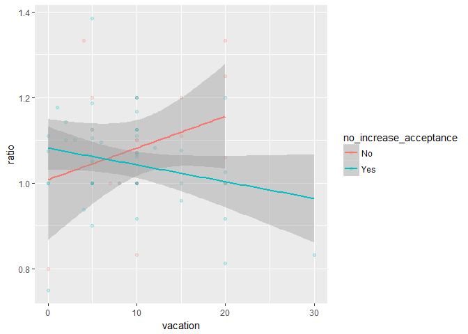

The difference is slopes is more radical in this case. It would appear that people who spend a larger percentage on vacation have a larger salary ratio **only** if they prefer a salary increase. The confidence intervals are fairly wide, but there might be some truth in the finding. It could contribute towards our hypothesis - people who spend a large percentage on vacation may be the people who are driven by money. In this case, it seems as if our confounding variable interaction could support our hypothesis - people who prefer a salary increase above job satisfaction are those with (possibly) higher social standards (we should be careful to assume that vacation is a direct indication of social standards) and are the same people who expect a higher salary ratio. However, the lack of statistical significance (we aren't yet considering adjusted p-values) and small number of observations mean that we cannot draw any conclusions. However, it is important to differentiate between the people who prefer job satisfaction and those who prefer an increase.

FIN
===

``` r
survey_tidy <- NULL

non_spendings <- colnames(survey_results)[!(colnames(survey_results) %in% spending_cats)]

for (spending in spending_cats){
  temp <- survey_results[ , non_spendings]
  temp$spending_cat <- spending
  temp$spending_val <- survey_results[[spending]]
  survey_tidy <- rbind(survey_tidy, temp)
}
```

``` r
for (i in unique(survey_tidy$id)){
  temp <- survey_tidy %>% filter(id == i)
  user_living <- as.numeric(temp %>% filter(temp$spending_cat == 'living_expenses') %>% select(spending_val))
  survey_tidy[survey_tidy$id == i, 'spending_ratio'] <- temp$spending_val/user_living
}
```

``` r
p_vals <- data.frame('category' = character(length(spending_cats)), 'slope' = numeric(length(spending_cats)), 'p_value' = numeric(length(spending_cats)), stringsAsFactors = FALSE)

count <-  0

for (i in spending_cats){
  count <- count + 1
  temp <- survey_tidy %>% filter(spending_cat == i)
  temp <- temp %>% filter(!is.na(spending_ratio) & abs(spending_ratio) != Inf)
  temp_lm <- lm(ratio ~ spending_ratio, data = temp)
  lm_summary <- summary(temp_lm)
  p_vals[count, 'category'] <- as.character(i)
  p_vals[count, 'slope'] <- temp_lm$coefficients[2]
  p_vals[count, 'p_value'] <- ifelse(nrow(lm_summary$coefficients) > 1, lm_summary$coefficients[2 , 4], NA)
}
```

``` r
p_vals
```

    ##            category       slope   p_value
    ## 1   living_expenses          NA        NA
    ## 2           savings 0.017609050 0.4853289
    ## 3          vacation 0.039636770 0.3421163
    ## 4     daily_leisure 0.035172804 0.1952824
    ## 5 consumption_goods 0.044671929 0.1117518
    ## 6    sports_hobbies 0.049321649 0.2727799
    ## 7             other 0.001945377 0.8619327

Checking for hidden things 8|
-----------------------------

``` r
ggplot(survey_tidy %>% filter(ratio < 10), aes(x = ratio, group = no_increase_acceptance, colour = no_increase_acceptance)) + 
  geom_density()
```

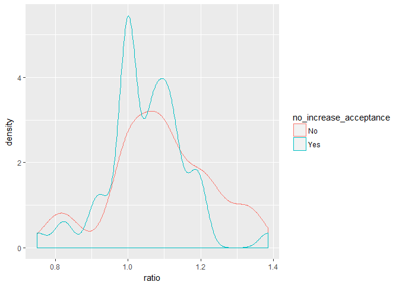

``` r
ggplot(survey_tidy %>% filter(ratio < 10), aes(x = ratio)) + 
  geom_density()
```

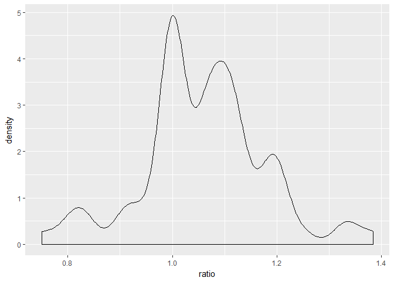

``` r
survey_results %>% 
  group_by(no_increase_acceptance) %>% 
  summarise(total = n())
```

    ## # A tibble: 2 x 2
    ##   no_increase_acceptance total
    ##   <chr>                  <int>
    ## 1 No                        20
    ## 2 Yes                       51

``` r
ggplot(survey_tidy %>% filter(ratio < 2), aes(y = spending_val, x = spending_cat, group = spending_cat, colour = spending_cat)) + 
  geom_boxplot()
```

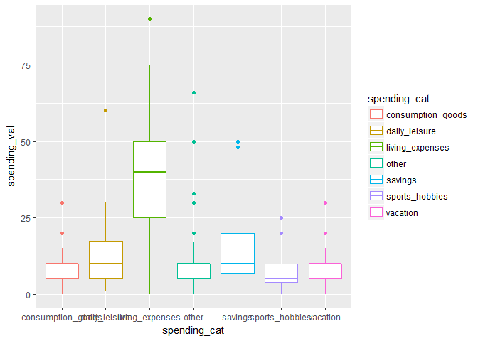

``` r
for (cat in spending_cats){
  temp <- survey_tidy %>% filter(spending_cat == cat & 
                                  ratio > 0.4 & 
                                  ratio < 1.6)
  
  temp <- temp %>% 
    mutate(spend_bin = ifelse(spending_val < quantile(spending_val, 0.25), "low", ifelse(spending_val < quantile(spending_val, 0.5), "med", ifelse(spending_val < quantile(spending_val, 0.75), "med_hi", "high"))))
  
  print(ggplot(temp, aes(x = spending_val, colour = no_increase_acceptance)) + 
    geom_density() + 
      labs(title = cat))
}
```

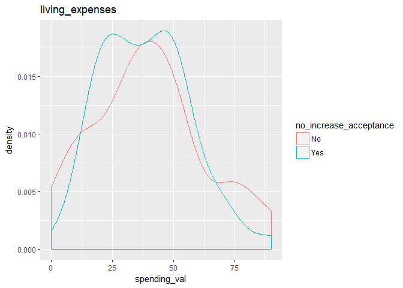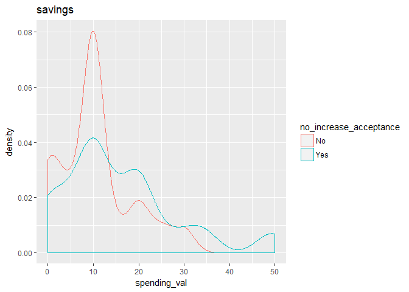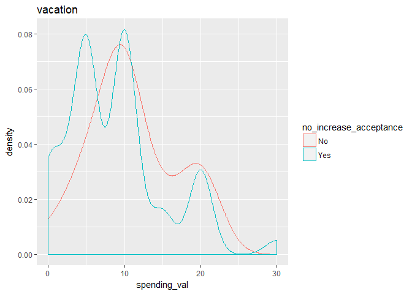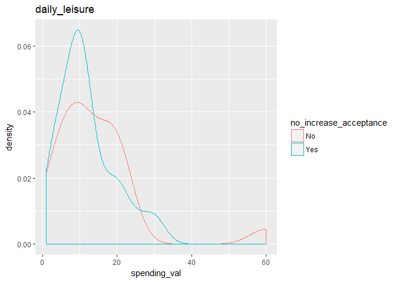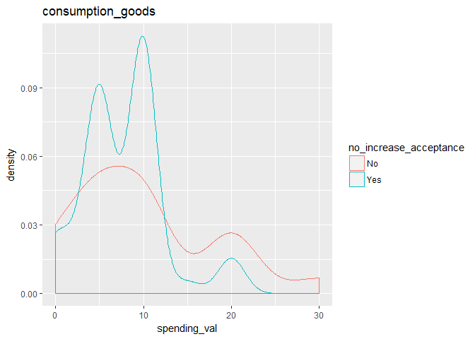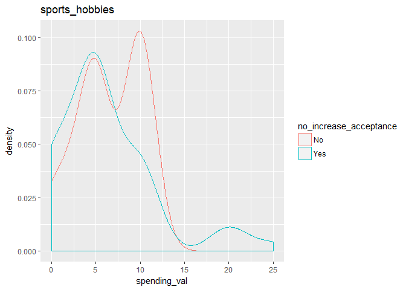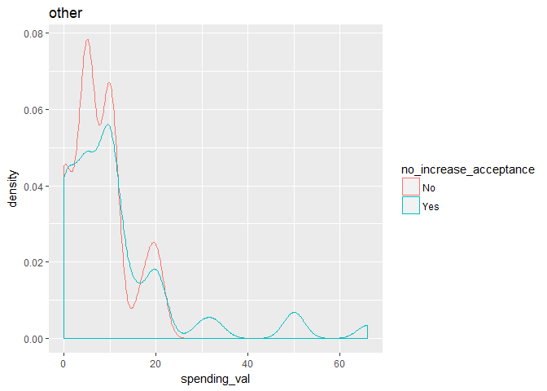

``` r
# ggplot(survey_tidy, aes(x = )
```

``` r
survey_explan <- survey_tidy %>% 
  mutate()
```
